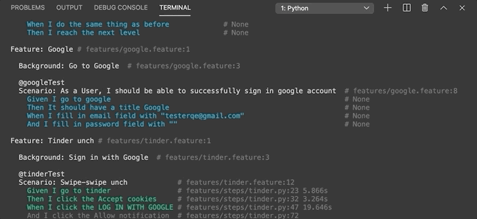

# Bot / Automation swipe on Tinder
Automation testing on website apps using selenium webdriver, behave, and python.


## Already tested
- macOS Catalina version 10.15.4
- Google Chrome Version 81.0.4044.138
- Firefox 76.0.1 (64-bit)

## Requirement
- python3, pip, virtualenv
- chromedriver / geckodriver

## Installation
go to the directory
```
- python3 -m venv [virtual name]
- source [virtual name]/bin/activate
- pip list
- pip install --upgrade pip (optional)
- pip install -r requirement.txt
- pip list
```

for stoping virtualenv
```
deactivate
```

## Preconditions
- Prepare your gmail account
- Prepare your facebook account
- Prepare your tinder account (with gmail or facebook)
- Install Chrome and Firefox on your PC or using chromedriver/geckodriver on directory `driver`
- Install python3 and pip on your PC
- Install virtualenv on your PC

## Env
Copy the .env.sample to .env
```
cp .env.sample .env
```

And then change the credential account
```
GOOGLE_URL=https://accounts.google.com/login
EMAIL_GMAIL=takingindisakiti@gmail.com  (change)
PASSWORD_GMAIL=pass123                  (change)

FACEBOOK_URL=https://web.facebook.com
EMAIL_FACEBOOK=damarsaklawase@gmail.com (change)
PASSWORD_FACEBOOK=pass123               (change)

TINDER_URL=https://tinder.com

BROWSER=chrome
```

Change the BROWSER to "chrome" or "firefox"

## Setup Browser
Go to `features > environment.py`

Change to Chrome/Firefox binary
```
context.browser = webdriver.Chrome(executable_path="../../Driver/mac/chromedriver")

or

context.browser = webdriver.Chrome(options=options)
```

## How to Run
```
behave --tags=@tinderGoogleTest         | Only feature with tags
behave --tags=@tinderFacebookTest       | Only feature with tags
behave --tags=~@skip                    | All feature without tags @skip
behave --tags=@one,@two                 | Only feature with tags
```
https://jenisys.github.io/behave.example/tutorials/tutorial11.html



## Structure
    .
    ...
    features                # Test directory
    ├── helpers             # Helpers files
    ├── object              # Object repository files
    ├── steps               # Step definition files
    ├── environment.py      # Hook files (before - after test)
    └── sample.feature      # Test files using feature format (behave)
    ...

## Note
- Belum ada handle jika muncul pop-up (install desktop apps, dan limitation swipe), maka akan fail setelah muncul pop-up
- Login di tinder terdeteksi bot, maka perlu input otp
- Login with google terdeteksi bot, maka perlu input verify code
- Login with google pada halaman sign in/up tinder kadang tidak muncul
- Belum setup reporter (allure, extend report, etc..)
- Please check on Security & Privacy (macOS) for allow access the browser driver
- File test gmail_sign_in_test.py adalah sample automation dengan cara tradisional (tanpa gherkin feature)

```
python gmail_sign_in_test.py
```

## Contact
- Please dm ig @damarresin